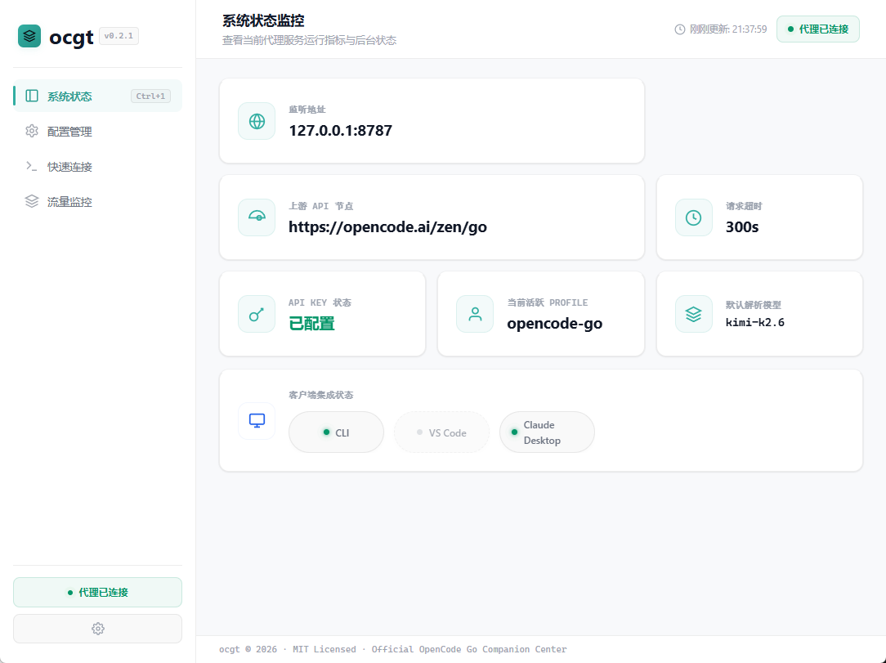
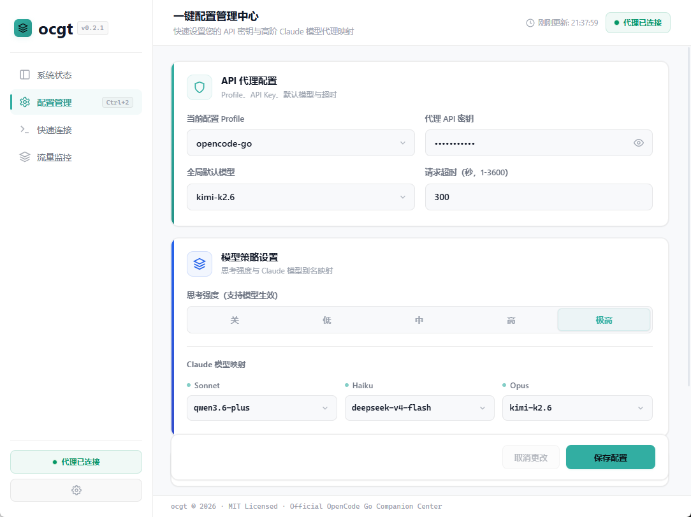
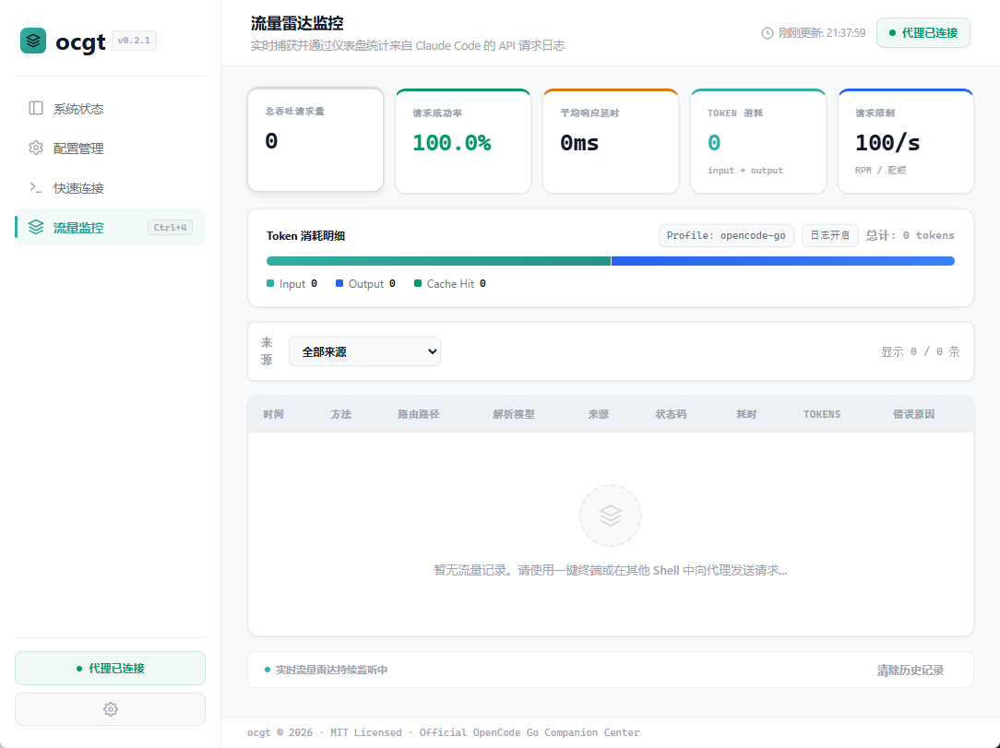

# ocgt — Claude Code 桌面客户端 & 本地代理


`ocgt` 是给 Claude Code 用的桌面客户端。核心就两件事：一个本地代理负责 Anthropic ↔ OpenAI 协议转换，一个 GUI 面板让你管 API Key、看流量、起终端。中英双语。当前版本 v2.2.1。

> 🌐 **[English Version](docs/README.en-US.md)**

---

## ✨ 核心功能

### 📊 系统状态看板

- 实时监控代理监听端口、上游 API 状态、API Key 配置
- 可视化配置文件路径，一键打开所在文件夹
- 客户端集成状态一目了然（CLI / VS Code / Claude Desktop）

### ⚙️ 配置管理



- 填入 API Key 保存即热重载生效，不用重启

- **模型映射**：Sonnet / Haiku / Opus 随便映射到上游模型

- **思考强度**：低 / 中 / 高 / 极高 / 关

- **同模型重试**：5 次指数退避 + 30s 断路器

### 💻 快速连接



- 一键拉起带全套代理环境变量的终端（PowerShell / Bash / CMD）

- 四种客户端集成：CLI（全局 settings.json）、VS Code、Claude Code settings、Claude Desktop App（3P Profile）

- 一键修复所有已配置的集成

### 📡 流量统计面板

- Token / 请求数 / 成功率 / 平均延迟，按小时/天/周自适应粒度展示

- **流量明细**（Ctrl+5）：全字段表格、三维筛选（时间+模型+状态）、分页导航、CSV 导出

### 📊 套餐额度看板

- Rolling / Weekly / Monthly 额度进度条

- 5 秒自动刷新，也可手动刷新

### 🧩 配套工具 — [ocgt-monitor](https://github.com/xxtt-01/ocgt-monitor)
- 独立终端监控工具，实时展示 ocgt 代理请求日志
- 彩色高亮输出，支持过滤和统计
- 与 ocgt GUI 互补使用，适合全屏终端工作流

### 🎨 偏好设置

- 主题：浅色 / 深色 / 跟随系统 · 5 种预设色 + 自定义色相

- 语言：中文 / English

- 关窗口时：每次问我 / 最小化到托盘 / 直接退出

---

## 🚀 快速开始


1. **下载**：[Releases](../../releases) → 选你系统的版本

2. **配置**：配置管理页（Ctrl+2）→ 填 API Key → 选模型 → 保存

3. **启动**：快速连接（Ctrl+3）→ 选终端 → 点一下 → 输 `claude`

---

## 🔒 安全特性

| 特性 | 说明 |
|------|------|
| **API Key 遮蔽** | 接口返回 `sk-...xxxx`，前端不暴露完整密钥 |
| **命令注入防护** | 终端启动用环境变量引用代替字符串拼接 |
| **自动认证** | Dashboard API 自动生成随机 Token，防止局域网未授权访问 |
| **IP 识别** | 限流器以 `RemoteAddr` 为准，XFF 仅信任 localhost |
| **优雅关机** | 追踪在途流式请求，最长等待 30s 再关闭 |
| **CORS 收紧** | 仅允许 localhost 来源跨域 |

---

## 📁 配置与热重载


```text

%USERPROFILE%\.ocgt\config.json

```


- **Schema 版本化**：`version` 字段 + `Migrate()` 迁移方法（当前 schema v1）

- **热重载**：检测文件修改时间，3 秒轮询，外部编辑自动生效

- **多 Profile**：`X-Ocgt-Profile` header 或默认走 `active_profile`

---

## 💻 命令行参考

```powershell
ocgt init       # 初始化默认配置
ocgt serve      # 后台运行代理服务
ocgt claude-env # 打印当前 Profile 环境变量
ocgt ccswitch   # 输出 CC Switch provider JSON
ocgt version    # 查看版本
```

---

## 🛠️ 构建

需要 Go 1.22+，Wails v2.12：

```powershell
go install github.com/wailsapp/wails/v2/cmd/wails@v2.12.0
wails dev          # 开发模式
wails build        # 生产构建
```

---

## ⚠️ 已知限制


代理转发时，用量统计可能存在偏差：


1. **缓存统计依赖上游**：DeepSeek/Qwen 等靠 `prompt_tokens_details.cached_tokens` 返回缓存数据，部分上游不返回就没法统计

2. **费用是估算值**：按官方定价表计算，跟实际账单可能有出入，仅供参考


这是架构限制，不是 Bug。

---

## 📄 许可证

MIT License

## 邀请链接

可以走此链接订购 go 计划：https://opencode.ai/go?ref=75Q34GPBZ1
