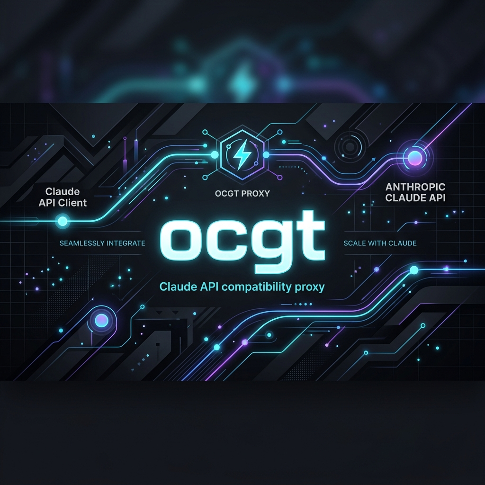

# ocgt - Claude Code Native GUI Control Panel & Proxy
### 专为 Claude Code 打造的原生极简双语控制面板与本地代理

`ocgt`（OpenCode Go Tools）是专为 **Claude Code** 与 **OpenCode Go**（opencode.ai）服务定制开发的原生桌面控制中心。它集成了超低延迟的本地兼容代理（将 Anthropic 格式请求转换为 OpenAI Chat Completions 协议），并提供了一个极简、直观、支持**中英文一键切换**的原生 GUI 交互面板。

开发者无需在命令行中手动配置繁琐的环境变量或修改系统 hosts，只需双击打开客户端，即可自动托管代理并一键拉起开发控制台。

---

## 🖥️ 核心功能与界面演示 (Features Showcase)

### 📊 系统状态看板 (System Status)

* 实时监控本地代理监听端口（默认 `127.0.0.1:8787`）及上游 API 状态。
* 可视化展示本地配置文件路径，支持一键打开配置文件夹。

### ⚙️ 极简配置管理 (Configuration)

* **专为 OpenCode Go 服务优化**：填入 API Key 即可秒级热重载生效。
* **模型映射 (Alias Mapping)**：支持针对 Claude 的 Sonnet、Haiku、Opus 模型自由映射上游平替模型。
* **思考强度 (Thinking Budget)**：提供固定档位选项（快速、慢速、深度、极客、关闭），降低误配概率。

### 💻 一键终端唤醒 (Terminal Launcher)

* 选择您常用的控制台类型（PowerShell / Bash / CMD）。
* 点击 **“一键拉起配置终端 (Launch)”** 即可秒级拉起已自动注入全部代理变量的原生终端。**进入窗口直接键入 `claude` 即可进入开发调试会话！**
* 针对已有外部终端或 IDE 窗口，提供一键复制环境变量与 CC Switch JSON 导入配置。

### 📡 流量雷达监控 (Traffic Monitoring)
* 实时捕获并展示来自 Claude Code 客户端的 API 请求日志、耗时、方法与状态码，并汇总成功率与平均延迟。

---

## 🚦 极简三步快速开始 (Quick Start)

1. **下载运行**：前往 [Releases](../../releases) 下载适用于您系统的原生可执行客户端（如 Windows 用户下载 `ocgt-windows-amd64.exe`），双击启动。
2. **保存配置**：在 **“配置管理 (Configuration)”** 页填入您的 **OpenCode Go API Key**，选择默认模型与思考强度，点击 **“保存并热重载配置”**。
3. **唤醒终端**：在 **“终端启动 (Terminal)”** 页选择终端类型，点击 **“一键拉起配置终端 (Launch)”**。在弹出的窗口中直接输入：
   ```bash
   claude
   ```

*(提示：终端类型只需选择并拉起任意一种您习惯的命令行窗口即可，无需重复拉起多种终端。)*

---

## 📁 配置文件与热重载 (Configuration)

配置首选项默认持久化保存在本地：
```text
%USERPROFILE%\.ocgt\config.json
```
得益于 **Hot Reload（热重载）** 机制，您在外部手动编辑此 JSON 文件，运行中的本地代理服务也会在 2.5 秒内自动加载并应用最新的配置，无需重启客户端。

---

## 🐙 使用 GitHub CLI 发布新版本 (Publishing with GitHub CLI)

如果您是团队开发者，在推送版本 Tag 后，可以使用 **GitHub CLI (`gh`)** 在终端中一键创建发布版本并上传编译好的原生 GUI 可执行程序，过程极其精简：

```powershell
# 使用 GitHub CLI 创建 Release 并上传构建好的 Windows GUI 可执行产物
gh release create v0.1.8 build\bin\ocgt_v0.1.8.exe --title "v0.1.8" --notes-file RELEASE_NOTES.md
```
这将配合项目内置的 GitHub Actions 自动分发机制，让用户即时获取最新的二进制客户端。

---

## 💻 进阶命令行参考 (CLI Reference)

虽然推荐使用直观的原生 GUI，但 `ocgt` 同样提供高度简化的命令行备用参数供极客使用：

```powershell
ocgt init       # 初始化默认配置文件
ocgt serve      # 在后台静默运行本地代理服务
ocgt claude-env # 打印当前 Profile 注入的代理环境变量
ocgt ccswitch   # 输出用于导入 CC Switch 路由器的 provider JSON 配置
ocgt version    # 查看当前运行时版本
```

---

## 🛠️ 构建与开发 (Build)

需要 Go 1.22+，使用 Wails CLI 工具进行编译。

**安装 Wails CLI**：
```powershell
go install github.com/wailsapp/wails/v2/cmd/wails@v2.12.0
```

**运行开发模式**：
```powershell
wails dev
```

**构建生产可执行文件**：
```powershell
.\build.bat
```

---

## 📄 开源许可证 (License)

本项目基于 **MIT License** 开源。
