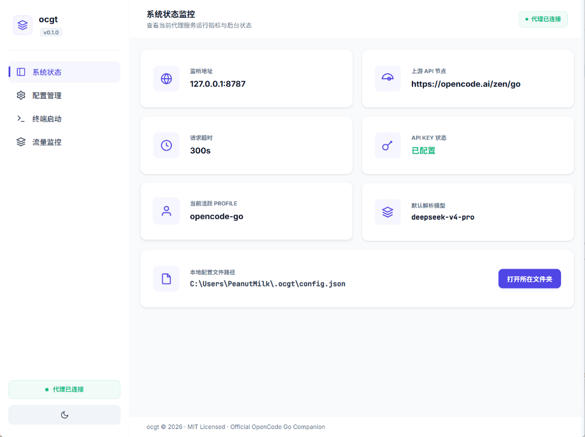
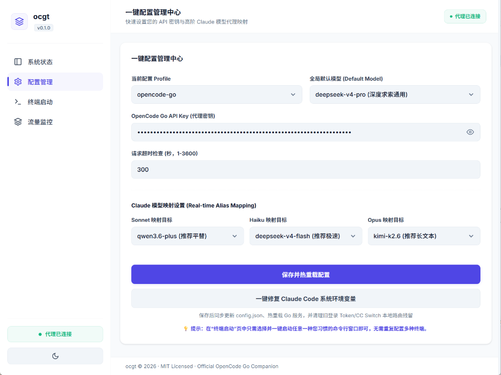
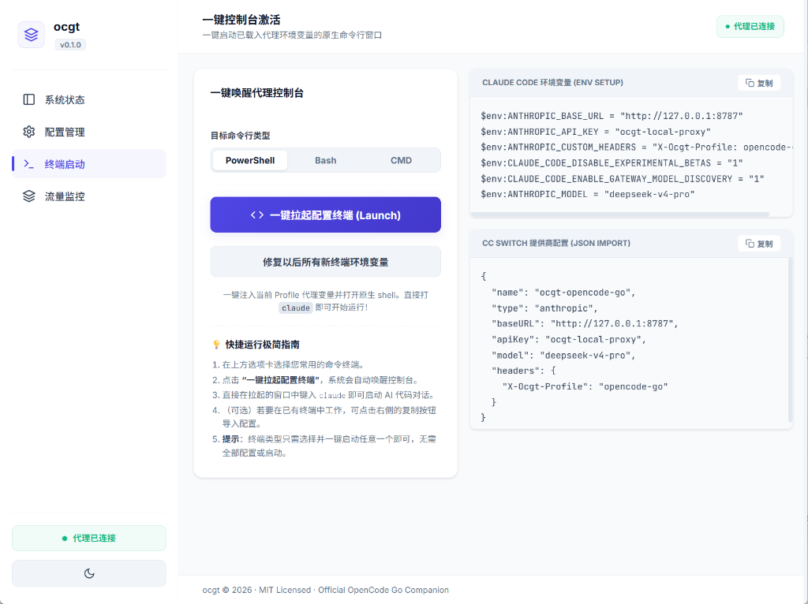

# ocgt — Claude Code 原生 GUI 控制面板与代理

> 🌐 **[English Version](docs/README.en-US.md)**

`ocgt`（OpenCode Go Tools）是专为 **Claude Code** 与 **OpenCode Go**（opencode.ai）定制的原生桌面控制中心。内置超低延迟本地代理（Anthropic ↔ OpenAI Chat Completions 协议互转），配合极简直觉的中英双语 GUI，一键拉起开发控制台。

---

## ✨ 核心功能

### 📊 系统状态看板

- 实时监控代理监听端口（默认 `127.0.0.1:8787`）及上游 API 状态
- 可视化配置文件路径，一键打开所在文件夹

### ⚙️ 极简配置管理

- 填入 API Key 即秒级热重载生效
- **模型映射**：Sonnet / Haiku / Opus 自由映射上游平替
- **思考强度**：快速 / 慢速 / 深度 / 极客 / 关闭，杜绝误配
- **模型回退链**：主模型失败自动尝试 FallbackChain

### 💻 一键终端唤醒

- 选 PowerShell / Bash / CMD，一键拉起已注入全部代理变量的原生终端
- 进入窗口直接 `claude` 即可开始
- 外部终端支持一键复制环境变量 & CC Switch JSON 导入

### 📡 流量雷达监控
- 实时捕获 Claude Code API 请求日志、耗时、状态码
- 汇总成功率与平均延迟

### 🎨 偏好设置中心
- 主题模式：浅色 / 深色 / 跟随系统
- 界面语言：中文 / English
- 关闭窗口行为：每次询问 / 最小化到托盘 / 退出程序

---

## 🚀 快速开始

1. **下载**：[Releases](../../releases) → 选系统版本（Windows: `ocgt_v0.2.0.exe`）
2. **配置**：配置管理页 → 填 **OpenCode Go API Key** → 选模型 → 保存并热重载
3. **启动**：终端启动页 → 选终端类型 → 一键拉起 → 输入 `claude`

---

## 🔒 安全特性

| 特性 | 说明 |
|------|------|
| **API Key 遮蔽** | 接口返回 `sk-...xxxx`，前端不暴露完整密钥 |
| **命令注入防护** | 终端启动用环境变量引用代替字符串拼接 |
| **自动认证** | Dashboard API 自动生成随机 Token，防止局域网未授权访问 |
| **IP 识别** | 限流器以 `RemoteAddr` 为准，XFF 仅信任 localhost |
| **优雅关机** | 追踪在途流式请求，最长等待 30s 再关闭 |
| **CORS 收紧** | 仅允许 localhost 来源跨域 |

---

## 🖼️ 图片 / 多模态支持

- **Anthropic 原生路径**：图片 content blocks 原样透传，完整支持
- **OpenAI 转换路径**：图片转为 `image_url` 结构体
- **自动降级**：目标模型不支持 vision 时，图片自动替换为 `[image]` 文本占位符，防止上游报错（如 DeepSeek 拒绝 `image_url`）

---

## 📁 配置与热重载

```text
%USERPROFILE%\.ocgt\config.json
```

- **Schema 版本化**：`version` 字段 + `Migrate()` 迁移方法，未来格式升级无感
- **热重载**：ModTime 检测 + 3s 轮询，外部编辑自动生效
- **多 Profile**：`X-Ocgt-Profile` header 或默认 `active_profile`

---

## 💻 命令行参考

```powershell
ocgt init       # 初始化默认配置
ocgt serve      # 后台运行代理服务
ocgt claude-env # 打印当前 Profile 环境变量
ocgt ccswitch   # 输出 CC Switch provider JSON
ocgt version    # 查看版本
```

---

## 🛠️ 构建

需要 Go 1.22+，Wails v2.12：

```powershell
go install github.com/wailsapp/wails/v2/cmd/wails@v2.12.0
wails dev          # 开发模式
.\build.bat        # 生产构建
```

---

## 📄 许可证

MIT License
