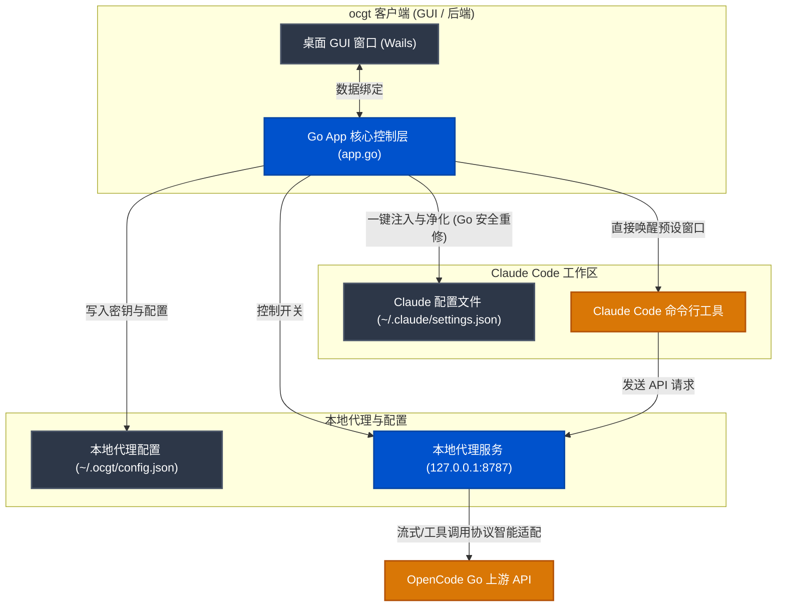

# ocgt - Claude API 兼容性代理与本地可视化控制面板

`ocgt` (OpenCode Go Tools) 是一个专为 **Claude Code** 打造的本地 API 兼容性代理工具。它内置了基于 Wails 的原生桌面 GUI 客户端和实时 Web 控制面板，旨在为国内开发者提供“一键式”对接国产大模型（如 Kimi、GLM、DeepSeek、Qwen、面壁 MiMo、MiniMax 等）的无缝体验。

为了让用户能够**零门槛、免配置开发环境直接运行**，我们提供了**一键双击即用的预编译版本**。用户无需安装 Go、Wails 或任何编译环境，即可完美运行可视化代理客户端并自动完成环境净化。

---

## 🖥️ 实际运行界面预览

以下为 `ocgt` 桌面客户端在实际环境中的运行截图：

### 1. 系统状态监控 (Status Monitor)

*图 1：双击运行即可展现直观的图形化面板，清晰查看当前监听端口、上游 API 节点、API Key 持久化状态及本地 `config.json` 配置路径。*

### 2. 一键配置管理中心 (Configuration)

*图 2：在界面中可以直接切换不同的配置 Profile，更新保存您的 OpenCode Go 密钥，并提供直观的可视化 Claude 模型映射（Sonnet/Haiku/Opus）设置，保存后自动完成 Go 后端热重载并同步修复系统残留。*

### 3. 一键控制台激活与唤醒 (Terminal Launcher)

*图 3：支持直接在界面上一键拉起预设好全部代理和独立环境变量的 CMD、PowerShell 窗口，只需在弹出窗口中直接运行 `claude` 即可进入工作，完全不污染全局环境变量。*

---

## 🗺️ 系统架构与数据流向

`ocgt` 桌面客户端、代理服务端与 Claude Code CLI 之间的协作交互流向如下：



---

## 🌟 核心特性

*   **⚡ 免安装环境预编译版**：直接双击运行，无需在系统里繁琐地安装 Go 编译器和 Wails CLI，真正的双击即用。
*   **🧹 一键环境注入与配置净化**：在 GUI 中点击 `一键修复 Claude Code 系统环境变量`，Go 后端在向系统注入代理环境变量的同时，会**自动解析并清洗 `~/.claude/settings.json`**，安全抹除历史残留的污染别名（如先前使用 `ccswith` 等配置遗留的 `astron-code-latest` 选项），保证模型菜单列表绝对干净。
*   **💻 一键拉起安全终端**：GUI 支持直接拉起已预设好代理和完全隔离的临时环境变量的 CMD/PowerShell 窗口，输入 `claude` 即可即开即用，完全不污染您的全局系统环境变量。
*   **🔄 双向协议适配**：代理层支持双向协议重构，将 Anthropic Messages 协议（流式响应、工具调用 Tool Calling、Token 计数）无缝转译为标准的 OpenAI 协议，并在内存中智能管理缓存，完美支持 DeepSeek 等模型的 Reasoning（思考过程）透传。

---

## 🚀 快速使用指南

### 推荐：直接运行预编译的 Release GUI 客户端（零门槛）

1.  **下载双击运行**：
    前往项目的 [Releases](../../releases) 页面，下载最新的 `ocgt.exe`。双击即可直接运行，程序启动后会在后台激活 `127.0.0.1:8787` 本地代理服务。
2.  **保存 API Key**：
    在 GUI 的“一键配置管理中心”区域，选定您的活跃 Profile（默认为 `opencode-go`），填入您的 OpenCode Go 密钥并点击 **保存并热重载配置**。
3.  **注入并净化环境**：
    点击 GUI 下方的 **一键修复 Claude Code 系统环境变量**，程序将完成系统变量写入，并自动清理 `.claude/settings.json` 中的过期残留别名。
4.  **拉起终端开始编码**：
    在 GUI 中点击“一键控制台激活”界面的 **一键拉起配置终端**。在弹出的 PowerShell/CMD 终端中直接输入 `claude` 即可进入工作。

---

### 开发：通过源码自行构建 GUI / CLI

如果您是开发者并希望自行构建项目，可参考以下命令：

*   **前置要求**：安装 Go 1.22+ 以及 Wails CLI。

```powershell
# 1. 编译原生 GUI 版本 (输出在 build\bin\ocgt.exe)
wails build

# 2. 编译极简 CLI 版本 (输出在 bin\ocgt.exe)
go build -o .\bin\ocgt.exe .\cmd\ocgt
```

---

## 📋 配置文件格式说明 (`config.json`)

默认配置文件存放在 `%USERPROFILE%\.ocgt\config.json`：

```json
{
  "listen": "127.0.0.1:8787",
  "upstream": "https://opencode.ai/zen/go",
  "request_timeout_seconds": 300,
  "active_profile": "opencode-go",
  "profiles": {
    "opencode-go": {
      "api_key_env": "OPENCODE_GO_API_KEY",
      "default_model": "kimi-k2.6",
      "model_aliases": {
        "deepseek": "deepseek-v4-pro",
        "flash": "deepseek-v4-flash",
        "glm": "glm-5.1",
        "haiku": "deepseek-v4-flash",
        "kimi": "kimi-k2.6",
        "opus": "kimi-k2.6",
        "qwen": "qwen3.6-plus",
        "sonnet": "qwen3.6-plus"
      }
    }
  }
}
```

---

## 🤖 模型映射关系

当 Claude Code 发出模型请求时，`ocgt` 会依据您当前活跃 Profile 的别名表自动路由至对应的上游 API 模型：

| 客户端选择 (Alias) | 上游实际模型 (Upstream Model) | 对标 Claude 角色 | 说明 |
| :--- | :--- | :--- | :--- |
| **`kimi` / `opus`** | `kimi-k2.6` | **Claude 3 Opus** | 默认首选。极强推理能力，适合解决复杂重构和 Debug 任务 |
| **`sonnet` / `qwen`** | `qwen3.6-plus` | **Claude 3.5 Sonnet** | 通义千问顶尖旗舰。响应敏捷，代码质量极高 |
| **`glm`** | `glm-5.1` | **Claude 3.5 Sonnet** | 智谱清言最新升级版。工具链调用与上下文关联能力强悍 |
| **`deepseek`** | `deepseek-v4-pro` | **Claude 3.5 Sonnet** | 深度求索专业版。优秀的推理逻辑与搜索整合 |
| **`haiku` / `flash`** | `deepseek-v4-flash` | **Claude 3 Haiku** | 低成本与高吞吐首选。适合轻量级分析与大面积代码扫描 |

---

## 📄 开源协议

本项目采用 **MIT License** 开源协议。欢迎大家提交 Issue 与 PR 共同完善本地代理体验！